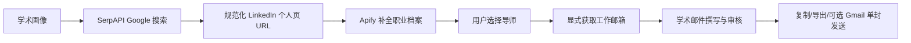

# Connact.ai 学术领域 MVP 设计与交付计划

状态：MVP 实施基线
日期：2026-09-16
适用版本：当前工作分支

## 1. MVP 决策

学术领域作为 `/finance` 的并列工作流上线，但第一版不建设导师目录、不实时抓取院系官网，也不引入全局导师数据库。MVP 必须与金融版使用同一套人员发现和邮箱获取基础设施：



这条链路与金融版一模一样：

1. SerpAPI 搜索 Google 已索引的 `linkedin.com/in/` 页面；它不是 LinkedIn API。
2. 后端过滤非个人页、去重并保存 canonical LinkedIn URL；该 URL 继续作为身份键。
3. Apify 为当前结果页准备结构化职业档案；页面在每条档案成功或记录明确失败后展示。
4. 工作邮箱仍由用户对已选联系人显式触发，不随搜索或翻页自动获取。核心路径复用 Apify work-email；部署中已有的可选 Apollo 匹配保持原行为。
5. 画像推荐、草稿、审核、Gmail 确认和跟进草稿全部复用现有能力，只增加学术语义和领域隔离。

MVP 的重点是尽快交付完整、可验证的导师联系流程，并复用已经过验证的限流、缓存、任务恢复和发送保护。导师目录爬虫、院系适配器、OpenAlex/ROR 补充、全局公共导师库和目录版本发布都属于后续优化，不能成为 MVP 的前置依赖。

## 2. 产品范围

### 2.1 MVP 必须完成

- `/academic` 五步引导流程：学术画像、选择导师、撰写邮件、审核、跟进；
- 学术 Persona 创建、编辑和领域隔离；
- 复用金融版 SerpAPI → LinkedIn → Apify → 邮箱链路；
- 以学校/机构、职称、地区、研究关键词搜索 Google 已索引的 LinkedIn 个人页；
- 当前页职业档案准备、详情、来源状态和明确的不可用状态；
- 按学术画像推荐至多 5 位候选人，并展示基于已有字段的相关性解释；
- 将选择的导师保存为 workspace Contact，并写入 `academic` 领域资料；
- 学术联系场景的邮件生成、编辑、自动保存、变量预览和 ready 审核；
- 复制、`.eml` 导出、可选 Gmail 单封发送；
- 手动跟进或创建待编辑的后续草稿序列；
- Mock 模式、后端契约/隔离测试、浏览器端到端测试；
- 金融流程无回归。

### 2.2 MVP 明确不做

- 学校或院系官网目录爬虫；
- 全局导师表、全局证据表、catalog version 或发布工作台；
- 每次搜索时抓取教师主页、实验室网站或院系目录；
- OpenAlex、ROR、ORCID、Semantic Scholar 等新增提供商；
- 预测录取概率、推断招生名额或把引用量当作推荐权重；
- 根据姓名猜测邮箱、查找私人邮箱或电话；
- 自动批量发送、自动执行多步骤 campaign；
- 自动合并同名学者。

### 2.3 后续优化

MVP 有真实使用数据后，再单独评估：

- 经许可审查的院系官网确定性爬虫；
- 带来源快照、差异审查和原子发布的全局导师库；
- OpenAlex 论文/主题及 ROR 机构规范化；
- 官方主页、招生声明和公开邮箱的时效标记；
- 语义向量检索、论文相似度、共著网络和导师比较；
- 多语言院校目录及管理员数据源工作台。

这些能力不得悄悄混入在线搜索请求。若后续建设，采集、审核和发布应作为独立离线流程。

## 3. 现有基础与最小改动

| 现有能力 | 学术 MVP 的用法 |
| --- | --- |
| `Persona.domain` | 保存 `finance` / `academic` 并按领域过滤 |
| `PeopleJob` | 复用异步搜索、状态轮询、历史和分页；缓存指纹加入 domain |
| SerpAPI people provider | 复用 Google `site:linkedin.com/in/` 搜索，仅替换学术查询字段 |
| Apify profile provider | 复用当前页职业档案准备、缓存和错误状态 |
| Apify/Apollo email action | 复用显式工作邮箱获取，不在学术搜索中自动调用 |
| `ContactDomainProfile` | 学术联系人写入 `domain="academic"`；MVP 数据仅使用现有 `sector` 键保存返回的研究方向 |
| `SourceEvidence` / `MatchAssessment` | 复用 workspace 证据与画像相关性结果 |
| Draft / Email Studio | 复用自动保存、变量预览、版本冲突和人工审核 |
| Gmail / Sequences | 复用单封确认发送和仅规划的跟进草稿 |

实现原则：优先增加 domain 参数、学术标签和专用输入映射，避免复制一套 provider、job worker 或联系人表。金融 API 和已保存数据继续兼容。

## 4. 学术五步工作流

| 步骤 | 用户操作 | 产物 | 继续条件 |
| --- | --- | --- | --- |
| 1 学术画像 | 新建或选择学术 Persona，填写背景、研究方向、方法、目标和联系目的 | `Persona(domain=academic)` + revision | 画像已保存且属于 academic |
| 2 选择导师 | 输入学校/机构、职称、地点和研究关键词，搜索并查看 Apify 档案，选择候选人 | PeopleJob、Contact、academic profile | 用户明确选择一位候选人 |
| 3 撰写邮件 | 选择 PhD/RA/科研实习等场景，生成或手工编辑邮件 | Draft + frozen persona/contact context | 主题和正文存在且保存成功 |
| 4 审核 | 检查替换变量、人物资料来源、邮箱状态及内容 | reviewed Draft | 无缺失变量；上下文未失效 |
| 5 跟进 | 复制、导出、可选 Gmail 单封发送，或创建后续草稿 | MailSend / Sequence drafts | Gmail 发送仍需现有显式确认 |

学术流程恢复键使用：

```text
connact-academic-flow:{workspace_id}
```

最小恢复状态为 `step`、`personaId`、`contactId`、`draftId` 和 `searchJobId`。恢复时必须验证 Persona 属于 academic，Draft 仍绑定同一 Persona/Contact。画像或联系人事实变化后，关联草稿回到 `draft`，要求重新审核。

## 5. 学术画像

第一版直接复用现有 `PersonaData` JSON 字段，并在学术 UI 中换成对应语义：

| 存储字段 | 学术 UI 语义 |
| --- | --- |
| `name` | Full name |
| `education` | Education |
| `experience` | Research and work experience |
| `skills` | Research skills and methods |
| `sectors` | Research interests |
| `career_goals` | Academic goals |
| `target_regions` | Target regions |
| `target_roles` | Target institutions or roles |
| `contact_purpose` | Default outreach purpose |

第一版通过这些自由文本字段表达 PhD、research internship 和 RA 目标，不新增机会类型枚举。博士后、访问学者与合作场景可以使用已有写作起点，但不承诺专用匹配字段。

创建和更新规则：

- 新建时显式保存 domain；旧客户端未传时继续按 finance 处理；
- Persona 创建后不直接跨领域修改，跨领域应另建画像；
- 列表和流程选择器按 domain 过滤；
- revision 快照包含 domain 与 data，防止使用错误领域的推荐缓存。

## 6. 搜索字段与查询映射

学术 UI 使用学术标签，但 wire contract 继续复用现有字段，并调用与金融版相同的搜索 provider：

| Wire 字段 | 学术 UI 标签 | SerpAPI 查询中的作用 |
| --- | --- | --- |
| `title` | Academic title | Professor、Associate Professor、Assistant Professor、Research Scientist 等职称 |
| `company` | Institution / university | 学校或研究机构名称 |
| `location` | Location | 城市、州或国家 |
| `keywords` | Research keywords | 研究主题、实验方向或方法关键词 |
| `sector` | Research area | 研究领域；Mock 模式也用它筛选学术 fixtures |

请求还包含共享分页字段 `page` 和 `per_page`，其中 `per_page` 最大为 10。MVP 不新增 `institution_ids`、`research_query` 等目录型 wire 字段。

后端构造 `site:linkedin.com/in/` Google 查询，最多返回当前页 10 条候选结果，并沿用 Google next-page 信号。总数是 Google 估计值，不得描述为某学校的完整导师人数。

结果详情以来源层级展示：

- SerpAPI：Google 标题、摘要和链接，属于未验证的发现证据；
- LinkedIn URL：规范化身份键，不代表平台对全部事实的验证；
- Apify：当前公开职业档案的结构化提取结果及获取时间；
- 邮箱：独立显式匹配结果，缺失、未匹配和 provider 错误保持不同状态。

搜索条件不能被复制成联系人事实。例如用户输入某学校，只能用于搜索，不能在结果未返回该学校时写入 Contact。

## 7. 联系人与领域隔离

候选结果继续落入 workspace-scoped Contact。保存学术候选人时：

- `provider` / `provider_id` 继续遵循现有 LinkedIn URL 身份与幂等规则；
- name、title、company、location、school、profile URL 只使用 provider 返回的字段；
- `ContactDomainProfile(domain="academic")` 保存当前候选人的学术扩展；MVP 先把 provider 返回的研究方向写入现有 `sector` 键；
- 证据和推荐结果仍属于当前 workspace；
- notes、tags、手工修正和已取得邮箱在重复搜索时保留；
- finance 与 academic 的搜索历史、推荐缓存和流程状态不能串用。

MVP 不存在系统级 mentor id 或 catalog version。联系人就是用户工作区中的候选/已保存人员记录。

## 8. API 与缓存边界

学术 MVP 使用独立语义路由，并在内部复用 Finance 的 provider、PeopleJob 和 Contact service：

| 方法 | 路径 | 用途 |
| --- | --- | --- |
| POST | `/api/academic/search` | 同步兼容搜索 |
| POST | `/api/academic/search/jobs` | 创建异步学术搜索任务 |
| GET | `/api/academic/search/jobs` | 读取当前 workspace 的学术搜索历史 |
| POST | `/api/academic/assess` | 对最多 5 位候选导师生成相关性解释 |
| GET | `/api/people/jobs/{id}` | 复用共享 PeopleJob 状态轮询 |

这些路由必须满足：

- PeopleJob 记录 `domain=academic`；
- 学术搜索由 `AcademicSearchInput` 校验共享 wire 字段，并在 provider 层映射到同一 SerpAPI 接口；
- job 查询、历史和恢复按 workspace + domain 隔离；
- profile 状态仍通过现有 PeopleJob 轮询返回；
- email action 使用现有联系人端点与确认行为；
- finance 路由和请求结构保持兼容。

搜索缓存指纹至少包含：

```text
domain + normalized_filters + page + per_page + PEOPLE_MODE + pipeline_version
```

MVP 推荐缓存沿用现有 MatchAssessment 条件，并通过联系人快照中的完整 `domains` 数据区分领域：

```text
persona_id + persona_version + contact_snapshot（含 domains）
+ language + AI provider mode
```

将具体模型和 prompt version 纳入推荐缓存键属于后续缓存加固，不是本次 MVP 的前置条件。

`PEOPLE_MODE=mock|live` 同时控制两个领域，因为 MVP 明确共享提供商链路。`PEOPLE_MODE=mock` 不得发起 SerpAPI、LinkedIn、Apify 或 Apollo 请求；Gmail 是独立配置，仍只在用户显式确认发送时调用。

## 9. 学术写作、审核和发送

学术写作起点的 API 值包括：

- `PhD Inquiry`；
- `Research Masters Inquiry`；
- `Research Internship`；
- `Research Assistant`；
- `Postdoc Inquiry`；
- `Academic Collaboration`；
- `Follow-up`。

学术流程创建首封草稿时默认使用 `PhD Inquiry`，用户可在邮件工作室选择其他学术起点。

生成规则：

- 只使用 Persona、Contact 和用户选中的现有证据；
- 用一至两个真实研究相关点说明联系原因；
- 明确用户背景、拟研究方向和一个具体请求；
- 不编造共同经历、论文阅读、介绍人、招生名额、资金或导师意愿；
- 默认保持简洁，英文约 120–180 词或相当长度中文；
- 推荐文本不得把相似度描述为录取概率。

ready 继续表示“内容已人工审核”，不代表邮箱已验证、可投递或已经发送。发送必须复用现有 Gmail preview、confirmed、幂等和 uncertain 处理。没有邮箱时仍允许保存、复制和导出草稿。

跟进仅生成可编辑草稿或 sequence plan；第一版不自动发送整个序列。MVP 与金融流程一样创建两份独立草稿，默认第二封间隔 3 天，用户可在 Sequences 中修改。

## 10. 前端结构

`/academic` 与 `/finance` 并列。MVP 直接让现有流程组件接收 domain，避免复制第二套步骤状态、保存守卫和恢复逻辑：

```text
frontend/components/
├── finance-flow.tsx           # `domain="finance" | "academic"` 的共享五步流程
├── personas.tsx               # 按 domain 切换画像字段和列表
├── people.tsx                 # 按 domain 切换路由、搜索标签和导师文案
├── email-studio.tsx           # 按 Draft.domain 提供写作起点
└── finance-review.tsx         # 共享审核、Gmail 与跟进草稿能力
```

UI 要求：

- `/academic` 不再显示 Coming Soon；
- 主导航和移动布局都能进入学术流程；
- 学术流程只显示 academic Persona；
- 搜索表单使用“职称、学校/机构、地区、研究关键词”等标签；
- 结果明确显示 LinkedIn 来源和 Apify 档案状态；
- 无资料、无邮箱、上游错误与处理中状态都有明确文案；
- 中英文界面不改变邮件语言选择。

不要为学术版复制 provider 调用、job 轮询或 Gmail 发送逻辑。共享行为应通过已有组件参数或小型公共 hook 复用。

## 11. 后端结构

后端在现有 provider 与 worker 之上增加最小领域分支：

```text
backend/app/
├── providers/                 # SerpAPI / Apify / Apollo 原实现继续共用
├── services/contacts.py       # upsert 接收 domain，写对应 ContactDomainProfile
├── routers/finance.py         # 保持兼容
└── routers/academic.py        # 学术请求校验和查询映射，可与 finance 共用 service
```

关键要求：

- 不新增 academic crawler、catalog repository 或在线官网抓取；
- 不因 domain 分支绕过 workspace 查询；
- provider 限流、并发、168 小时 profile 缓存和显式 email 行为保持一致；
- 同一 canonical LinkedIn URL 重复出现时幂等复用 Contact；
- 学术推荐仅消费已保存的 Persona/Contact 字段，不生成新人物事实。

## 12. 数据迁移与兼容

迁移只增加 MVP 确实需要的领域字段：

- `PersonaRevision`、`UploadedDocument`、`Draft`、`PeopleJob` 和 `Sequence` 增加 domain，旧记录按关联 Persona、首个序列草稿或 finance 回填；
- UploadedDocument 的解析缓存唯一键加入 domain，避免金融简历与学术 CV 共用解析结果；
- Sequence 固定为单一 domain，创建和更新时拒绝混合不同领域的 Draft、Persona 或 Contact；Template 保持领域中立；
- 旧 schema 无法表达 Academic Draft、Sequence 或 PeopleJob；存在这些记录时 downgrade 明确中止，避免静默改标为 finance；仅有 Academic 文档时使用可恢复标记安全停用解析缓存；
- MatchAssessment 继续使用 Persona 版本、包含完整 domains 的 Contact 快照、语言和 AI provider mode 作为缓存条件；
- 现有 Contact 唯一约束和 workspace 范围不变。

本阶段不创建 institution、unit、mentor、catalog source/run/snapshot/version 等全局表。

## 13. 测试与验收

### 13.1 后端

- finance/academic Persona 创建、列表和更新隔离；
- academic 请求正确生成 `site:linkedin.com/in/` 查询；
- 学术搜索调用与金融版相同的 SerpAPI provider；
- 当前页结果调用与金融版相同的 Apify profile provider；
- 搜索或翻页不会自动调用邮箱 provider；
- 显式 email action 的成功、无匹配、无邮箱和错误状态保持一致；
- PeopleJob 历史、分页和缓存按 domain 隔离；
- canonical LinkedIn URL 去重，重复搜索保留已获取的邮箱和用户字段；
- academic ContactDomainProfile 正确写入且不覆盖 finance profile；
- Gmail 仍要求显式确认；
- Mock 模式全程离线，学术搜索固定使用 12 位虚构导师；测试邮箱只使用保留的 `.example` 域名。

### 13.2 前端 E2E

- `/academic` 渲染五步流程而非 Coming Soon；
- 新建 academic Persona 后可进入导师搜索；
- 学术标签提交搜索，选中候选人后只创建一个上下文 Draft；
- 刷新和离开页面后恢复同一流程状态；
- 保存失败保留编辑内容且阻止进入审核；
- 缺失变量阻止 ready；
- 创建跟进后仍保留原 Draft；
- Mock E2E 不主动触发 email、send 或 activate 等外部动作；
- 现有 finance-flow、people、writing、mail、auth、admin 测试全部回归。

### 13.3 MVP 完成定义

- 新用户能完成学术画像 → SerpAPI 搜索 → LinkedIn URL → Apify 档案 → 选择导师 → 草稿 → 审核 → 复制/导出的闭环；
- 配置好邮箱 provider 后，用户能对单个候选人显式获取工作邮箱；
- 配置好 Gmail 后，用户能在现有额外确认流程中发送单封邮件；
- 缺少外部 API key、资料或邮箱时界面明确降级，不伪装成功；
- Mock 模式可离线演示完整流程；
- 金融版行为、数据和测试保持兼容；
- 代码与数据库中不存在 MVP 必需的导师目录或全局库依赖。

## 14. 建议交付顺序

| 阶段 | 主要交付 |
| --- | --- |
| M0 领域基础 | Persona/PeopleJob/Contact 的 domain 贯通，金融回归 |
| M1 学术搜索 | 学术输入映射到既有 SerpAPI，复用 LinkedIn 规范化和 Apify profile |
| M2 学术流程 | `/academic` 五步 UI、恢复、草稿上下文和审核 |
| M3 邮箱与跟进 | 复用显式 email action、Gmail 单封发送和 sequence draft |
| M4 验收 | Mock 全流程、后端契约、Playwright、移动布局和文档 |

每个阶段都先运行相关测试，再运行金融 E2E 回归。导师目录探索应放在独立的后续项目，不与 MVP 上线绑定。

## 15. 风险与控制

| 风险 | MVP 控制 |
| --- | --- |
| Google 索引不完整或陈旧 | 明示 SerpAPI 是发现证据，总数是估计值，不宣称完整导师名单 |
| LinkedIn 资料缺失 | Apify 返回缺失/失败状态，字段保持 unknown |
| 同名或身份错误 | canonical URL 去重，不凭姓名自动合并 |
| 搜索条件被误当事实 | 只保存 provider 返回字段，筛选词不写入 Contact |
| 邮箱不可投递 | 邮箱匹配与档案分开，ready 不等于 verified |
| AI 编造研究事实 | 仅使用现有 Persona/Contact/evidence，保留人工审核门槛 |
| 两个领域数据串线 | job、persona、profile、cache 和恢复状态都包含 domain |
| 学术功能拖累金融稳定性 | 共用已验证 provider，保持兼容路由并运行完整金融回归 |

## 16. 后续导师库的启动条件

只有当 MVP 使用数据证明“Google/LinkedIn 覆盖不足”是主要瓶颈，并且团队已经明确首批学校、院系范围、许可、更新责任和纠错机制后，才启动全局导师库。该项目至少需要：来源 blueprint、robots/条款审查、缓存 fixture、原始快照、运行差异审查、人工发布、字段级 evidence、删除/纠错流程和独立回滚方案。

在这些条件满足前，院系目录爬虫和全局库都保持后续优化，不进入 MVP 依赖图。
