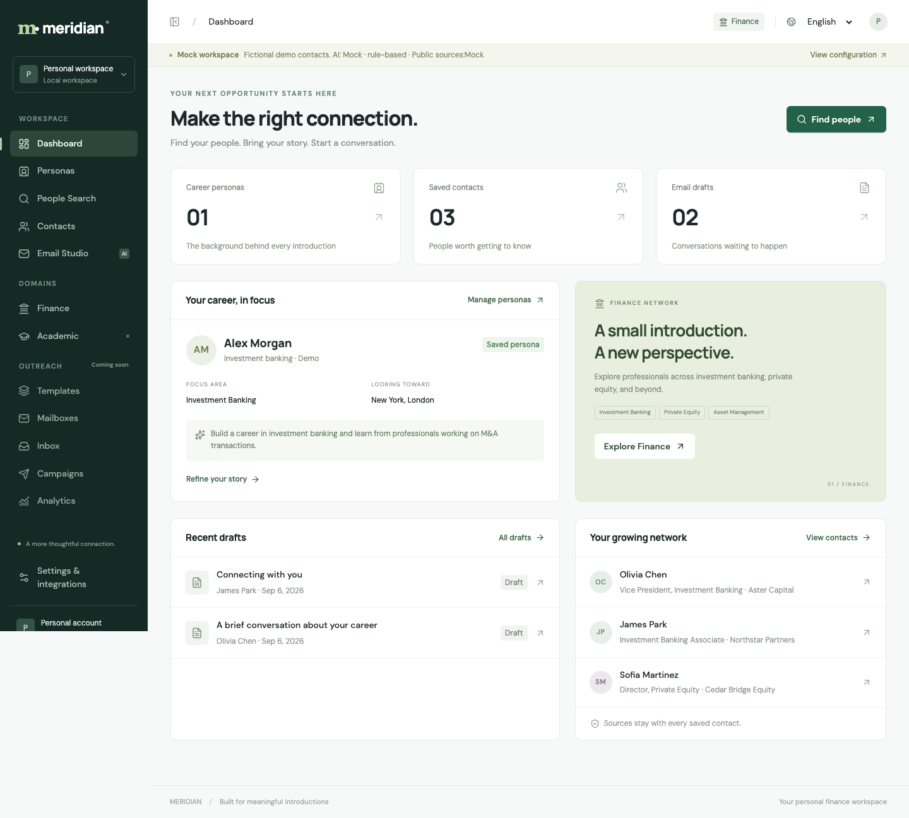

# MVP 验证记录

验证日期：2026-09-06。本记录区分实际运行结果、契约测试和未验证部分。

## 实际运行环境

- macOS ARM64，Node.js 26.7.0，Python 3.12.14。
- Next.js 16.3.4 / React 19.2.4 / Tiptap 3.31.3。
- FastAPI 0.135.1，SQLAlchemy 2.0.48，Alembic 1.18.4。
- **真实 PostgreSQL 18.4**，项目内开发实例，绑定 `127.0.0.1:54329`。
- 应用工作区 `local-personal`；服务端测试使用独立的 `meridian_test` PostgreSQL 数据库。
- 三类第三方服务均显式设置为 Mock；浏览器流程仍真实经过 Next.js → FastAPI → PostgreSQL。

## 结果

| 检查 | 结果 | 实际覆盖 |
| --- | --- | --- |
| PostgreSQL 迁移 | 通过 | Alembic 初始迁移升级成功，`alembic check` 无结构漂移；附 `schema.sql` |
| 服务端测试 | **15 passed** | 完整业务流程、独立工作区、画像版本、重复保存、分页、限额、错误、草稿锁、解析与变量 |
| 浏览器测试 | **4 passed** | Chromium 中执行完整表单、搜索、保存、编辑、预览、复制与刷新操作 |
| TypeScript / 生产构建 | 通过 | `npm run typecheck` 与 `npm run build`；无类型或编译错误 |
| 应用健康 | 通过 | `/api/health` 返回 `status=ok, database=postgresql`；前端 HTTP 200 |
| 全栈重启与持久化 | 通过 | 停止 Next.js、FastAPI、PostgreSQL 后，用 `SEED_DEMO=1 ./scripts/dev.sh` 重启；1 画像 / 3 联系人 / 2 草稿的全部记录 ID 完整保留 |
| 演示数据幂等 | 通过 | 重启时再次执行 seed，提示已存在，未创建重复数据 |
| 桌面和移动布局 | 通过 | 1440×1000 与 390×844 截图；移动端页面无水平溢出，表格在内部横向滚动 |

## 完成标准对照

1. **画像**：手动创建并修改后刷新读取；DOCX 在浏览器上传，文本 PDF 在服务端真实提取；姓名、教育、技能等字段与文件一致。扫描/无文本 PDF、非法类型、损坏 PDF 返回明确失败。
2. **搜索与推荐**：16 条虚构人物按职位/公司/地区/关键词/领域过滤并分页。推荐以所选画像的确切目标和联系人已知字段构造，保留来源 ID 与画像版本。
3. **保存联系人**：刷新后仍存在；再次保存显示已保存。再次搜索复用提供商 ID，不产生新联系人。
4. **邮件编辑**：从联系人抽屉进入编辑器，生成包含变量的邮件，手动修改主题与正文。单独验证中文生成，以及加粗内容保存后重新打开。
5. **预览与复制**：使用真实数据库字段替换收件人姓名、机构及发件人姓名。测试读取了浏览器实际剪贴板，确认包含最终联系人姓名。缺失或未知变量时，审核按钮不可用，服务端同样拒绝。
6. **完整 Mock**：界面顶栏、搜索行、推荐及生成内容显示 Mock；虚构邮箱使用 `.example`。整个流程未调用第三方 API。
7. **真适配器**：Apollo 参数、受限姓名/缺邮箱、HTTP 403；SerpAPI 链接和最多三条结果；AI JSON 格式和错误响应都有隔离契约测试。没有真实密钥，未执行真实供应商请求。
8. **未来入口**：Academic、Templates、Mailboxes、Inbox、Campaigns、Analytics、Settings 均有用途说明和 Coming Soon。Academic 没有生成导师数据；Gmail 显示尚未连接，无发送成功状态。

## 特别验证的保存行为

- PostgreSQL 两个请求使用同一草稿版本同时保存：一个 200，一个 409；不会无提示覆盖。
- 模拟一次缓慢网络请求，在首个保存未完成时继续修改主题和正文，再点击离开页面：最新内容排队保存，重新打开后完整存在。
- 浏览器网络请求中断：显示 Save failed，编辑缓冲仍保留；恢复网络、点击 Retry save 后成功持久化。
- 修改画像或联系人：关联草稿退出 Reviewed 状态、增加版本，要求重新检查。
- 修复 Tiptap 切换只读状态时意外触发更新的问题；只读状态切换不会重置审核状态。

## 尚未验证与边界

- **Apollo / SerpAPI / 真实 AI：未做真实账号端到端验证。** 契约测试使用受控 HTTP 响应，不能证明账号权限、实时数据覆盖或费用。
- **Docker Compose：配置已提供，当前机器没有 Docker，未实际构建/运行容器。** Compose 使用 PostgreSQL 16；当前实际验证的本地 PostgreSQL 为 18.4。迁移使用标准 JSON、外键、唯一索引和行锁，没有 PostgreSQL 18 专属语法。
- 本地单用户模式不提供公开部署所需的认证授权。
- Mock 简历字段提取依赖章节标题；扫描件不做 OCR，复杂布局可能需手动补齐。
- 推荐选择和外部服务调用同步执行，有每次与每分钟上限，未进行多人压力测试。
- 第三方依赖的测试客户端产生 2 条弃用警告；测试通过，不影响当前运行。

## 预览截图

移动截图见 [mobile.png](mobile.png)。截图采用虚构种子数据，不代表真实金融人士。
